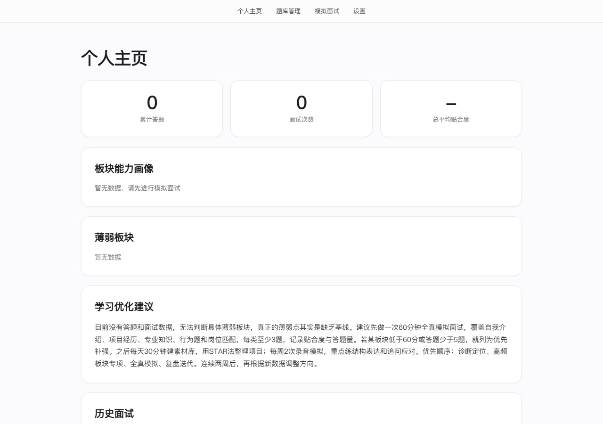
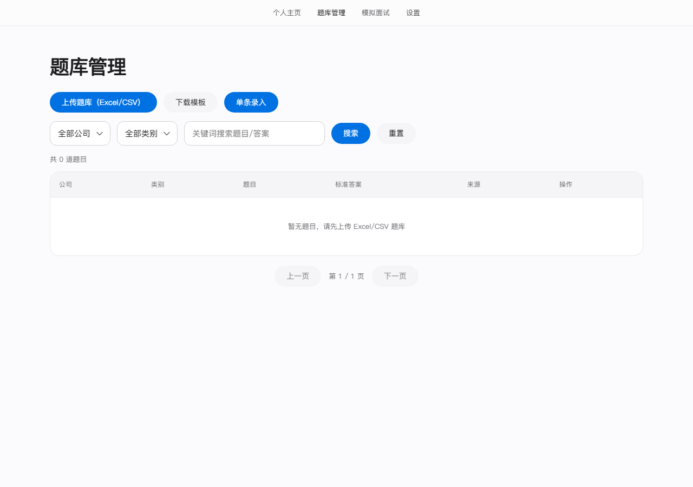
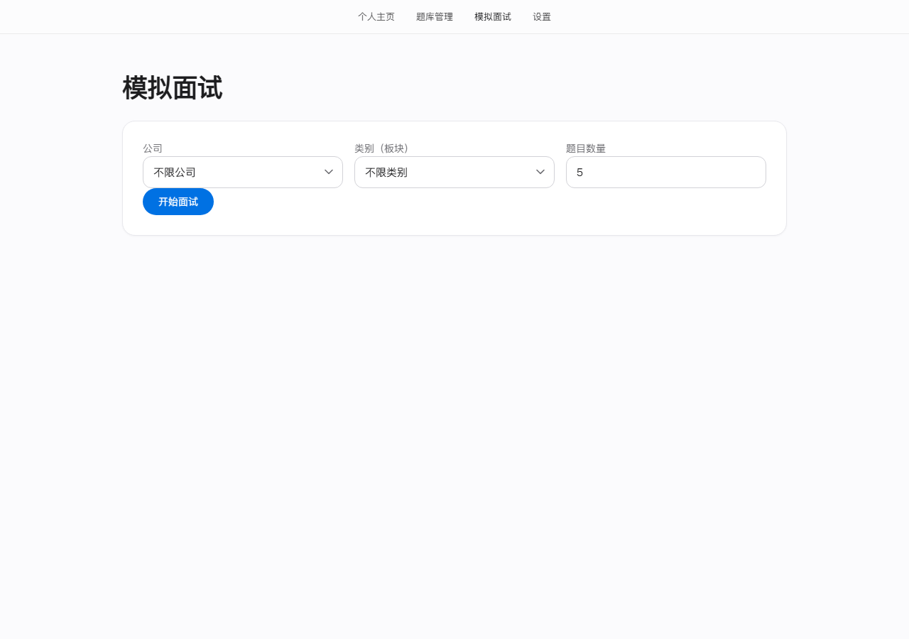
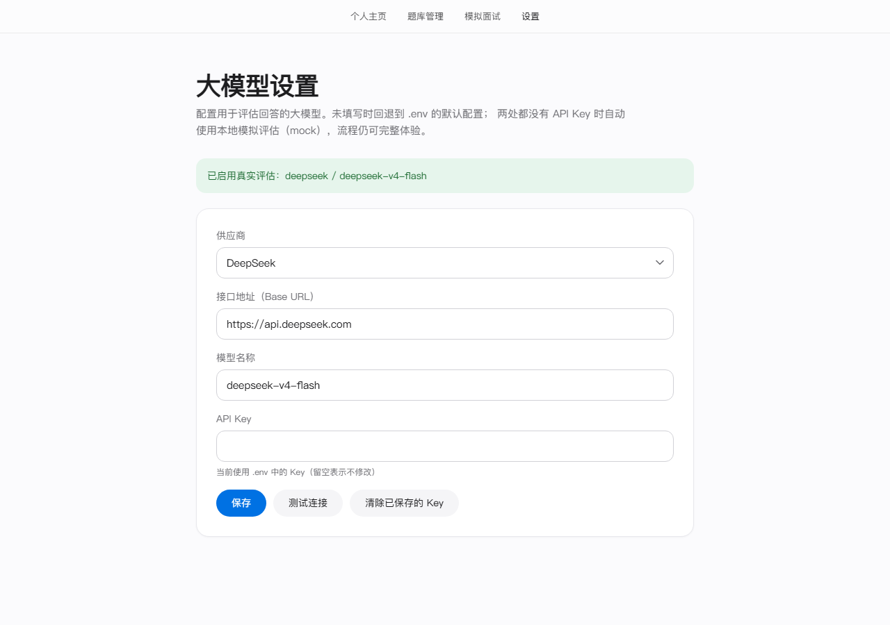

# AI 模拟面试智能体 · AI Mock Interview

[](LICENSE)
[](https://www.python.org/)
[](https://fastapi.tiangolo.com/)
[]()

基于 FastAPI 的 AI 模拟面试系统，用于个人面试练习：录入题库（标注公司），由大模型评估你的回答与标准答案的贴合程度，分析优缺点，生成分析报告，并据此维护个人画像、给出学习优化建议。界面简洁，功能开箱即用。

**A local-first AI mock interview system built with FastAPI.** Import your question bank (tagged by company), answer randomly drawn questions, and let an LLM (DeepSeek / OpenAI / Qwen / any OpenAI-compatible endpoint) score how closely your answer matches the reference, highlight strengths & weaknesses, and generate a personalized study plan. Runs entirely on your own machine — no account required.

> **本地单机应用**：直接在自己电脑上运行，无需注册 / 登录，服务默认只监听 `127.0.0.1`。如果你要把它放到公网，请自行补充鉴权与 HTTPS 等防护。
>
> **Local single-machine app**: run it on your own computer. No sign-up. The server listens on `127.0.0.1` by default; add your own auth & HTTPS if you expose it publicly.

## 界面预览 · Screenshots

| 个人主页 · Home | 题库管理 · Question bank |
| --- | --- |
|  |  |

| 模拟面试 · Mock interview | 大模型设置 · Settings |
| --- | --- |
|  |  |

## 功能

- **知识库**：Excel/CSV 批量导入 + 按模板单条录入，按公司/类别管理，可查看、筛选（分页浏览）、编辑、删除已录入题目
- **模拟面试**：按公司 + 类别 + 数量随机抽题，逐题作答，每题即时评分与点评（优点/不足/建议/标准答案对比）
- **分析报告**：面试结束生成整体分析报告（逐题结果 + 综合评语）
- **用户画像**：按板块聚合贴合度得分，识别薄弱板块，给出学习优化建议；历史快照按需保存（`POST /api/profile/snapshots`，最多保留最近 50 条）
- **大模型设置**：在「设置」页选择供应商（DeepSeek / OpenAI / 通义千问 / 自定义 OpenAI 兼容接口），填写 API Key、Base URL 与模型，支持「测试连接」；配置保存在本地数据库（**API Key 加密存储**），未配置时回退 `.env`，两处都没有 Key 时自动使用本地 mock 评估

## Features (English)

- **Question bank**: bulk import from Excel/CSV or add one-by-one; manage, filter, edit and delete questions by company/category
- **Mock interview**: randomly draw questions by company + category + count; answer one by one with instant scoring & feedback (strengths / weaknesses / suggestions / reference answer)
- **Report**: a full analysis report after each interview (per-question results + overall comment)
- **Profile**: aggregate scores by category to spot weak areas and get a personalized study plan; save snapshots on demand (up to 50)
- **LLM settings**: pick a provider (DeepSeek / OpenAI / Qwen / custom OpenAI-compatible), enter API Key, Base URL & model, with a "test connection" button; config stored locally (**API keys encrypted**), falls back to `.env`, then to a local mock evaluator

## 快速开始

### 1. 环境要求

- Python 3.11+（开发环境 3.13）

### 2. 安装依赖

```bash
python -m venv .venv
# Windows
.venv\Scripts\activate
# macOS / Linux
source .venv/bin/activate

pip install -r requirements.txt
```

> Windows 可直接双击 `start.bat`，macOS / Linux 运行 `bash start.sh`：脚本会自动建虚拟环境、装依赖、并在缺 Key 时提示配置。

### 3. 配置大模型（二选一）

**方式 A（推荐）：启动后在网页里配置**

进入「设置」页选择供应商、填写 API Key 与模型，点「保存」即可；可随时点「**测试连接**」验证是否可用（尚未保存的表单值也能先测）。配置存在本地数据库里，无需编辑文件。

**方式 B：通过 `.env` 配置默认值**

复制 `.env.example` 为 `.env` 并填写：

```bash
cp .env.example .env
```

```
DEEPSEEK_API_KEY=sk-xxxxxxxx
DEEPSEEK_BASE_URL=https://api.deepseek.com
DEEPSEEK_MODEL=deepseek-chat
USE_MOCK_EVALUATOR=false
```

优先级：网页设置 > `.env` 默认值 > mock。未配置任何 Key（或 `USE_MOCK_EVALUATOR=true`）时，系统使用 mock 评估器（规则启发式打分），可先本地体验完整流程、不产生费用。

> 注意：`.env` 里的 `DEEPSEEK_*` 只在供应商为 **DeepSeek**（默认）时作为回退默认值；若在设置页切换到 OpenAI / 通义千问 / 自定义，请在设置页填写该供应商自己的 Key 与模型名。

> 大模型调用失败或返回内容无法解析时，系统会自动降级为本地规则评分，并在界面上**明确提示**（不会静默把降级结果当成真实评估）。

### 4. 启动

```bash
# 一键脚本：自动检测 Python、创建虚拟环境、安装依赖、启动并打开浏览器
# Windows：双击 start.bat
bash start.sh          # macOS / Linux / Git Bash（可传端口：bash start.sh 9000）

# 或直接用 Python
python run.py
```

浏览器访问 <http://127.0.0.1:8000>（默认端口 8000）

### 5. 使用流程

1. （可选）进入「设置」配置大模型供应商与 API Key
2. 进入「题库管理」，下载模板（CSV）按列填写后上传（支持 `.csv` / `.xlsx`），或点击「单条录入」逐条添加（示例见 `examples/sample_knowledge.csv`）
3. 进入「模拟面试」选择公司 / 类别 / 题目数量，开始面试
4. 每题提交后即时查看贴合度评分与点评
5. 进入「个人主页」查看板块画像、薄弱板块与学习优化建议

## 题库录入格式（Excel / CSV）

批量导入强制使用 **Excel（.xlsx）或 CSV（.csv）** 文件，模板列如下：

| 列名 | 含义 | 是否必填 |
| --- | --- | --- |
| `公司` | 题目所属公司 | 必填 |
| `类别` | 题目板块（即画像维度） | 必填 |
| `题目` | 面试题 | 必填 |
| `标准答案` | 参考答案 | 必填 |
| `评分要点` | 评估时的加分要点 | 可选 |

示例：

```csv
公司,类别,题目,标准答案,评分要点
阿里巴巴,Java基础,String 和 StringBuilder 的区别？,String 不可变；StringBuilder 可变、适合频繁拼接。,说明不可变性;说明性能优势
```

- 列名支持常见别名（如「问题」=题目、「答案」=标准答案、「分类/板块」=类别）。
- 「类别」即用户画像的「板块」维度，用于聚合得分与识别薄弱项。
- 同一公司 + 类别 + 题目重复导入时自动跳过（去重）。
- CSV 支持 UTF-8 / GBK 编码（Excel 直接另存为 CSV 也可导入）。
- 除批量导入外，题库管理页支持「单条录入」按相同字段逐条添加。

## 数据与迁移

- 数据默认保存在项目根目录的 `interview.db`（SQLite），可在 `.env` 用 `DATABASE_URL` 修改位置。
- 数据库结构由 **Alembic** 管理：首次启动会自动建库建表，之后模型变更时应用启动会自动升级到最新结构，**无需手动操作**。
- 数据库中的 API Key 会**加密存储**：密钥来自 `.env` 的 `APP_SECRET_KEY`，未设置时自动生成项目根目录的 `.secret_key` 文件（已加入 `.gitignore`）。删除或更换密钥后需重新填写 Key。
- 如需手动操作（如生成新迁移）：

```bash
alembic revision --autogenerate -m "描述"
alembic upgrade head
```

## 测试

```bash
pytest
```

覆盖 CSV/Excel 解析、评估 JSON 解析降级、抽题、画像聚合、LLM 配置脱敏与回退，以及导入→面试→报告→画像的端到端流程（mock 模式）。

## 项目结构

```
app/
  main.py                  FastAPI 入口（路由/静态/健康检查）
  config.py                配置（读取 .env）
  database.py              SQLAlchemy 引擎与会话、Alembic 自动升级
  models.py                ORM 模型（AppSetting/KnowledgeItem/Interview/Answer/ProfileSnapshot）
  security.py              敏感字段加解密（API Key 存储）
  routers/
    knowledge.py           知识库 API（上传/模板/单条录入/列表/编辑/删除/聚合）
    interview.py           面试 API（创建/提交/结束/历史/报告）
    profile.py             画像 API（总览/快照）
    settings.py            设置 API（LLM 供应商配置：查看/保存/测试连接）
  services/
    knowledge_import.py    CSV/Excel 题库解析
    draw.py                抽题逻辑
    llm_config.py          LLM 配置解析（供应商预设、回退 .env、Key 脱敏）
    deepseek.py            OpenAI 兼容客户端封装（DeepSeek/OpenAI/Qwen/自定义）
    evaluator.py           回答评估（prompt + JSON 解析 + mock）
    report.py              面试整体报告
    profile.py             画像聚合与学习建议
  static/
    style.css              全局主题样式（Apple 风格）
    index.html             个人主页
    knowledge.html         题库管理
    interview.html         模拟面试
    settings.html          大模型设置
alembic/                   数据库迁移（启动自动升级）
  versions/                迁移脚本
examples/
  sample_knowledge.csv     示例题库（模板格式）
tests/                     单元与端到端测试
run.py                     开发启动入口
alembic.ini                Alembic 配置
```

## 技术栈

Python 3.13 / FastAPI / SQLAlchemy / Alembic / SQLite / cryptography / 多家大模型（OpenAI 兼容接口：DeepSeek、OpenAI、通义千问、自定义）/ 原生 HTML + JS（无构建工具）
